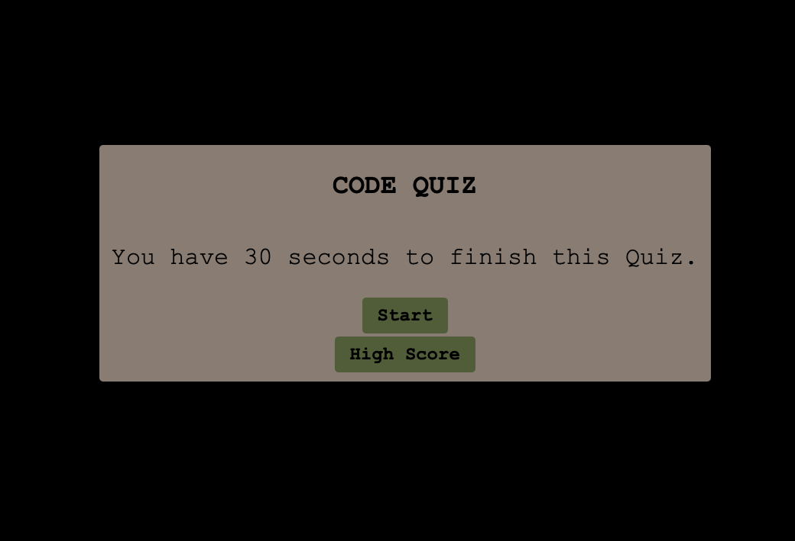
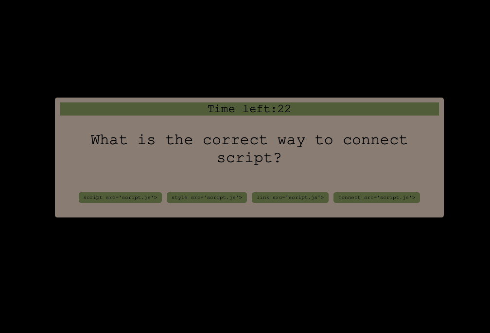
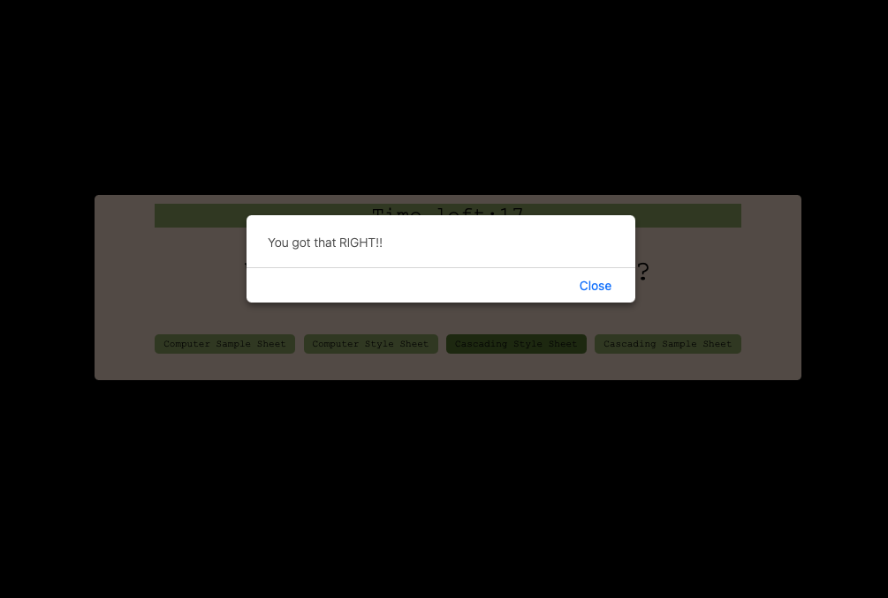
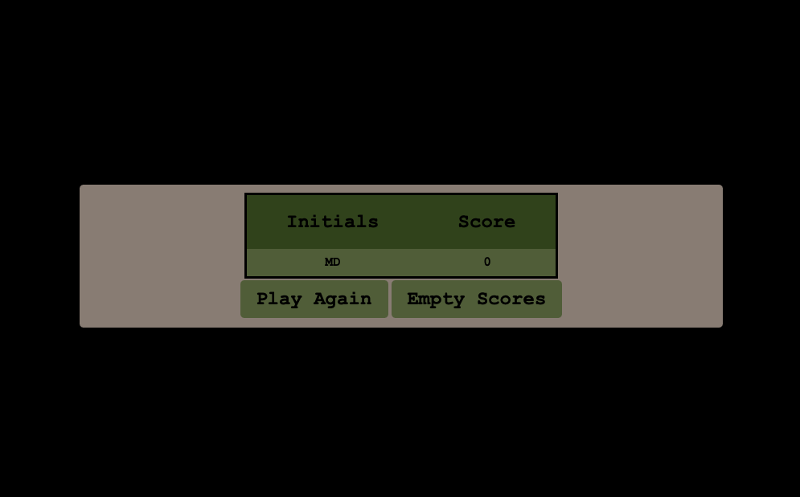

# Interactive Code Quiz
Interactive Code Quiz
- This coding quiz is build as an example of coding assessments similar to those employers create for hiring processes. 
- This quiz is timed and with multiple choice questions.
- When the start button is clicked the quiz will start, and used is presented with a question.
- When the question is answered a new question is presented.
- Incorrect questions subtract time from the clock and once the quiz is done or time runs out the game will be over.
- Option to save initials and score.

# Skills Used

- Javascript
- CSS
- HTML

# Images

# Link
https://madavila5.github.io/InteractiveCodeQuiz/